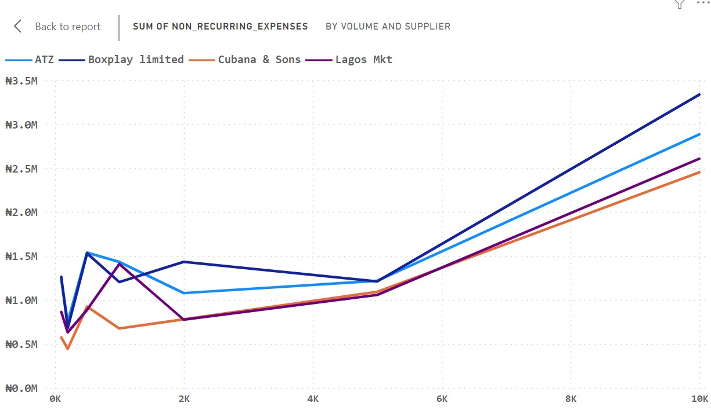
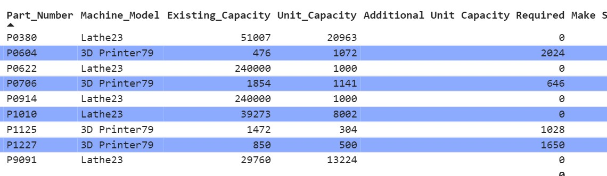
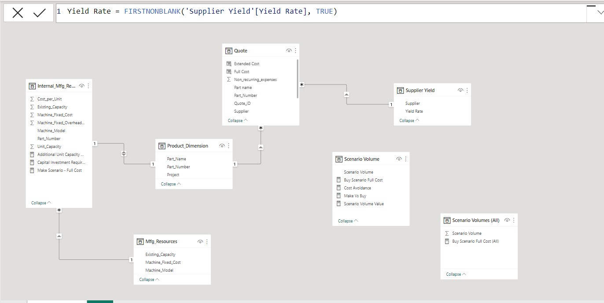
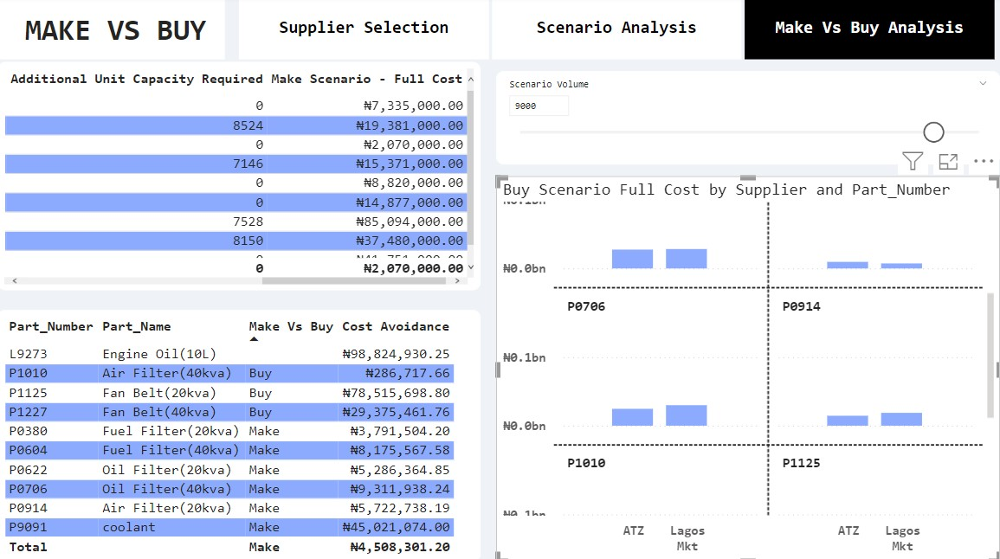

# Supply_Chain_Analytics
A supply chain includes all the raw materials and parts that are made into a product and distributed up the chain for manufacture and sale.

In this project of mine I wont only categorize supply chain under the manufacturing zone, supply chain touches procurement, logistics and other corporate sectors. My focus will be more on the procurement zone. Procurement on its own is a critical component of supply chain management process. Procurement specifically refers to the process of acquiring goods & services.

That been said above, let's head right into our supply chain analytics projects.

The Supply Chain begins with the producers of raw materials and ends with the product being delivered to the consumer. In this project we will be more of the consumer side. so lets dive in to one of the terms that will help us in the supply chain ecosystem.

What is make vs buys
“Make versus buy” is a strategic decision-making process that organizations go through when determining whether to produce (make) a product or component in-house or to purchase (buy) it from external suppliers. This decision has significant implications for cost, quality, time-to-market, and resource allocation.

The Problem Statement

You are a Data analyst in a company that is into production of generators, spare parts and servicing. Your task is to create analyses that help the company determine make vs buy decision for many of their products they use in servicing their generators. The management has already requested quotes from the suppliers. Lets look at the data that we will be using for this analysis.

From the image above we can see the numbers of tables we will be working with. The scenario volume, scenario volume(All), supplier yield, are not the raw data, those are table created to support our analytics context.

Lets explore the quote data in detail.
Quotes :
I remember when i was still little, any time my mum sent me to the market, she always gave me a list of things to buy, with their prices, she will tell me the shops to go and the one not to go, so in essence she has done her own analysis. This was done to avoid stories that touches, though they will still be stories from me at the end of the day. So lets look at quotes as the list of things to buy.

Definition : Quotes refers to a formal document provided by a supplier to a potential customer or buyer. This document outlines the pricing, terms, and conditions for the products or services that the supplier is offering. Quotes are an essential part of the procurement or supply chain process, as they allow buyers to compare different suppliers and make informed decisions based on factors such as cost, quality, and delivery time.
They essentially say “ if you buy X volume of this part, you will need to pay Unit Cost per unit and a one-time cost equal to NON-reoccurring expenses.

Quotes are specific to the product, volume and supplier. So in that case for supply chain decisions, it does not make sense to aggregate these fields. So I will set the volume columns in Power Bi, which has summarization set to default to Don’t summarize.

Lets create a visualization displaying all of the fields in the quote table, with a column chart that shows the number of unit price quotes provided for each part number.

The image above showcases my supplier selection visualizations dashboard, The sole purpose of this dashboard is to help you determine the best option in the case of suppliers that you can choose to supply the products you need for your services. There are about 7 visualization in the supplier selection dashboard, which will be broken down for further explanations.

They are :

Cost breakdown
Sum of unit cost by volume and supplier.
Sum of non reoccurring expenses by volume and supplier.
A card visual that shows the lowest cost supplier
A volume and a part number slicer
and a table visual, that consist of part number, part name, sum of unit cost etc.
let me try to break down some of the terms that i will use that are related to supply chain:

Unit cost: This is the cost associated with producing or procuring a single unit of a product.

Extended cost: The cost paid for the products only (does not include onetime expenses)

Extended Cost = (Unit Cost) * (Quantity of Units Purchased)

Non-recurring expenses: One-time costs required to enable production. Non-recurring expenses are generally not part of the regular ongoing operational costs of an entity. Instead, they arise from special circumstances or events.

Common examples of non-recurring expenses

• Legal fees
• Engineering expenses for production set-up
• Minimum charge to occupy manufacturing equipment.
• Currency exchange losses or Gains
• Environmental Cleanup cost

Full Cost
The total amount a company must pay to buy a certain quantity of products
Full Cost = Extended Cost + non-recurring expenses
Or
Full Cost = (10000 per gallon * 10gallons) + 65000 set-up fee = 165000

Visualizing lowest cost supplier
Scenario

My line manager has asked for a report page that shows :

The suppliers name with the lowest full cost for a part number and quote volume combination.
The full cost breakdown by extended cost and full cost.
Visibility to all of the other supplier quotes and full cost for the part number.
To use a card visualization that shows lowest full cost supplier for the part number & volume combination
All of these instructions and recommendation has been done on fig 3. but lets try to solve a problem.

Management are asking for something specific, like; what is the lowest full cost for a part number of P1010 on a volume of 2000.

To answer the question above:

The lowest cost supplier for part number P1010 on a volume 2000 is ATZ , we can also see it has the lowest non reoccurring expenses on the 2000 volume mark. In my opinion and based on this analysis we will all go for ATZ.

You can view the dashboard & interact with it here :https://app.powerbi.com/reportEmbed?reportId=0e909fee-aed2-490b-8f5e-36b6eed57236&autoAuth=true&ctid=e1e4f47f-4370-4de4-8a71-48984d434887

Creating a volume parameter and scenario analysis
We will explore building a scenario analysis tool to examine how our cost calculations change as volumes change.

Note:
In reality its highly unlikely to order the amount of product that was quoted.
Projects start with assumptions, so analysis tools should adjust to this uncertainty

Scenario & volume changes
What if our production estimate does not match the quoted volume. To be honest, things are not that straight forward as I made it seem earlier. Because it is highly unlikely to order the exact numbers that were quoted. That is where the scenario analysis comes in.

All projects starts with uncertainty, sources of uncertainty are :
• Demand
• Product market fit
• External economic conditions
• Price

In fig 4 we created a scenario volume parameter. This will make the report dynamic. Parameters adds a user-controlled slicer to the report. you can find it on the top right corner.

This will help to identify how the cost calculations changes and in the dashboard it shows how the full cost changes across different potential production volumes.

Adding a volume parameter

What happens if our company decided to order a volume that is different from the few points quoted?

This is where DAX parameter comes in. This will help us to create a scenario planning tool that calculates full cost for a wider range of production volumes.

A new report page was created as you can see in fig 4. called scenario analysis. some of the analysis and calculation that were done to achieve this :

A numeric “Scenario Volume” parameter ranging from 100 units to 10000 units with a default value of 1500 and an increment value of 50 was created.
I created a table with part number, supplier , volume, unit cost and non-recurring expenses column from the quotes. No columns will be summarized
Using the MINX() function, i created a “ Scenario Full Cost” measure in the Scenario volume table that computes the minimum full cost for the given Scenario Volume parameter

Recall full cost is the extended cost and non-recurring expenses.
I did not filter volumes exceeding the scenario volume at this stage: we will address that in the next step
I will update our measure to only calculate for valid quotes for the scenario volume Instead of passing the entire Quotes table to the MINX() function, use the FILTER() function to pass a filtered table that only includes quotes with volumes less than or equal to the scenario volume parameter.
This was the calculation done for that : Buy Scenario Full Cost = MINX(FILTER(Quote, Quote[Volume] <= ‘Scenario Volume’[Scenario Volume Value]),([Scenario Volume Value] * Quote[Unit_Cost] / Quote[Yield Rate] + Quote[Non_recurring_expenses]))

Displaying nonrecurring expenses

We now have a dynamic full cost measure that updates with volume
The finance team is interested in the breakdown between the nonrecurring expenses for cash flow reasons. They would like your scenario planner to show the breakdown of those costs. you can see a glimpse of this on fig 5.

Analyzing volumes across the quoted range

Now that I have created a volume parameter and responsive measures. Lets make a visualization in the scenario planner report. This report will help the supply chain team analyze the lowest-cost supplier choice over a range of potential production volumes.

This will be done by:

Creating a “Scenario Volumes (All)” table that has all of the possible values in the scenario Volume table.
I will use the MINX() function to create a “Full Cost(All) measure that calculates the minimum full cost for any volume in the scenario volumes (ALL) table
This will aid us in creating the line chart to show how the full cost for each supplier changes across all scenario volumes.
Problem Task

Which supplier has the lowest full cost for part number of P1227 at a production volume of 5000, what is that cost?

Answer

We can see that the answer is ATZ supplier with its full cost on #4,834,450.47

Adding row level security
The supply chain team want to see:

The lowest cost supplier name prominently on the page.
They only want to see results relevant to their own project
I will create security roles for “Project TNS Team Member” and “Project ONT”. Each role should only show rows related to the specific project name.

Doing this in power bi, is actually really straight forward. In the manage roles, I will assign different Roles. This will be done by assigning different DAX rules based on the tables in the data model. Users in the role will only see rows where the DAX formula resolves to true.

You can use the view roles to see the project that is your priority.

Select any project you are interested in, and the dashboard will only show you, visuals for that. This will help in access control and role management. But since my focus is not on that, I wont go deeper.

Make Vs Buy

As a company that want to gets products for its services, one of the stages every one passes through is the decision of choosing between making a product or buying one. The factor that really influences this decision is the cost factor. Everyone wants to get something with quality and its equally affordable.

I will work on the internal costs manufacturing costs — the “Make” option in the Make versus Buy. Internal estimate data comprises of :

Cost per unit :
• Raw material
• Energy
• Labor

It also includes the data of the equipment that is used to manufacture the parts.Internal estimates include part of specific data:

• Machine model
• Existing capacity
• Cost of new machine

If production exceeds capacity, new investment is required, that's where cost of new machine and new hands for labor comes in.

In the make vs buy decision we should only consider our incremental cost

Incremental equipment costs
Incremental costs : New costs introduced by our make or buy decision, not sunk costs that exists before the decision. This is the equipment needed formula i used :
Machines Required to Purchase = Roundup((Production Volume — Existing Capacity) / Unit Capacity, 0)

Note: Sunk cost refers to the money, time, or resources that have already been invested in a project, activity, or decision and cannot be recovered.

Other types of incremental cost

New facilities.
Salaried labor such as engineering, production planners.
Required unit capacity

Lets say for example the company, has some internal manufacturing capacity. You are now tasked with calculating the full costs for the parts based on the internal cost quotes.
When looking at internal , we must priorities capacity and capital investments in manufacturing equipment's.

When we observe the internal_mfg_Resource_Estimates table. You will notice that there are different quotes for different volumes, only a Cost_per_unit, Unit Capacity, Existing Capacity and Machine_Fixed_Cost. These fields will be key to determining what our capital investment(similar to the non-reoccurring expenses) will be.

Steps

The slicer for the scenario volume was added
The table visualization with the Part_Name and Part_Number fields from the Production_Dimension table was created. I added the fields: Machine_Model, Existing_Capacity, and Unit_Capacity from the Internal_Mfg_Resource_Estimates table.
I will calculate the manufacturing machine investment required to meet the volumes.
I will do that by identifying the difference between our capacity and production demand.
In Internal_mfg_Resource_estimates table, add, “Additional Unit Capacity Required” measure to show the gap between existing unit capacity and maximum of the scenario volume value.
If the existing capacity is greater than the scenario volume, the measure should be zero. Use the MINX() function to accomplish this.
Problem Statement

If the volume parameter is on 2500 units, what is the difference between the existing capacity and the required capacity for “P0706”?

Answer

P0706 part number has a additional unit capacity requirement of 646 units, that is the difference.

Full cost with capital investment

Now that we have created a measure to calculate the excess production demand. We can now use that to calculate the capital investment cost, which will allow us to calculate the full cost of the make option.
We have calculated the number of units that manufacturing does not have capacity for, we can calculate the cost of the investment required to meet the scenario volume.
In the Internal Manufacturing Estimates table, I will create a measure “ Capital Investment Required (Make)” which is the number of machines required multiplied by the cost of the machine (Machine_Fixed_Cost).
We now have our initial costs ( Capital Investment Required (Make)), lets now calculate the full costs for the make option.
I will create a “Make Scenario — Full Cost” measure.

Assessing Make Vs Buy Decision
When contemplating supply chain decisions such as Make vs Buy, quantifying the decision’s impact is helpful

Create a “Cost Avoidance” Measure in the Scenario Volume that returns the positive impact of either the make or the buy decision, whichever has the lower cost

COST OF QUALITY

PROBLEM SCENARIO :
I presented my make versus buy analysis tool to the TNS project team, they were impressed, but they had some feedback and issues.

Regional Managers of the field team said: “ We have quality issues with the Lagos Mkt & ATZ suppliers. The cost impact is at the negative side”
They’ve asked us to update the cost model with these factors .

I will use the “View AS” to view the report as a member of TNS Project
The Regional Managers or quality team says the poor quality from Lagos market and ATZ have An impact on our cost analysis. So this made the quality assurance department provide the following estimates for yield by supplier, where yield is the percentage of units that pass the quality tests
Yield Results: Lagos Mkt : 72% , ATZ : 83%, other supplier : 98%


I will use the Enter Data feature to create a “Supplier Yield” table with all of the suppliers and a column of their corresponding “Yield Rate”.
Lets create a relationship between the quotes table and the Supplier Yield table on the supplier column, so that the Yield Rate applies to the supplier.

This is showing the data model of our tables and we have been able to create a relationship between the supplier yield just created to the quote table, which is the fact table.
I will use the Yield Rate from the Quotes table to modify the existing measure “Buy Scenario Full Cost and Buy Scenario Extended Cost”.
A yield rate of .90 means that for every 100 units we order, only 90 will be acceptable! In order to hit our scenario volume, we need to order [Scenario Volume Value] / [Yield Rate] Units.

This shows our make vs buy dashboard.

Problem

Lets change the volume to 9000. what cost will the company spend on the part name “Oil filter 40kva”

Answer

We will be optioning to make the product instead of buying it, because to make it is cheaper than buying it. The cost avoidance will be about 9 million naira. This helps the company to save money.

The amount we are paying is #15,371,000 against the cheapest option of buying from the ATZ suppliers which is in the figure of #24,682,938. I bet everyone will be happy with this.

Note : other analysis aspects could be added, just like time and quality.

Thank you.

You can view the dashboard & interact with it here : https://app.powerbi.com/reportEmbed?reportId=0e909fee-aed2-490b-8f5e-36b6eed57236&autoAuth=true&ctid=e1e4f47f-4370-4de4-8a71-48984d434887

