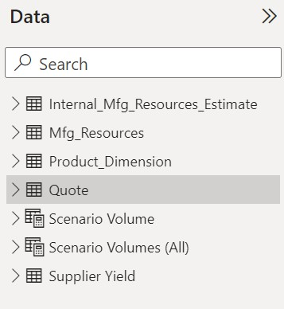
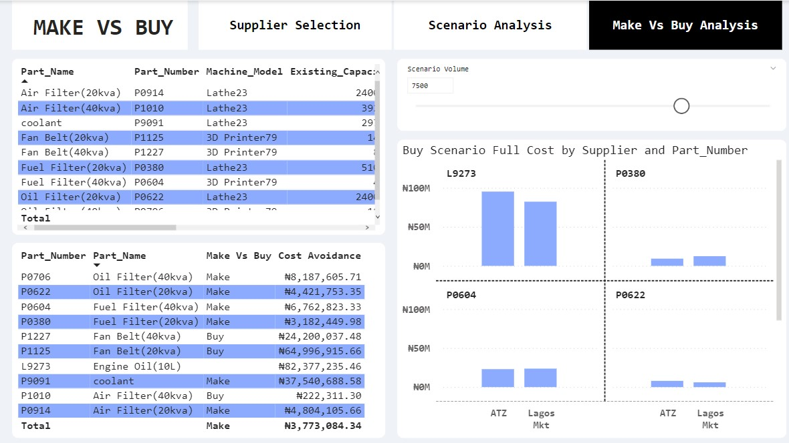
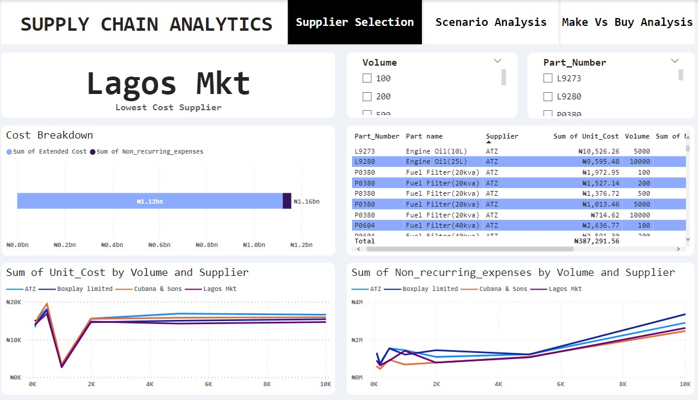
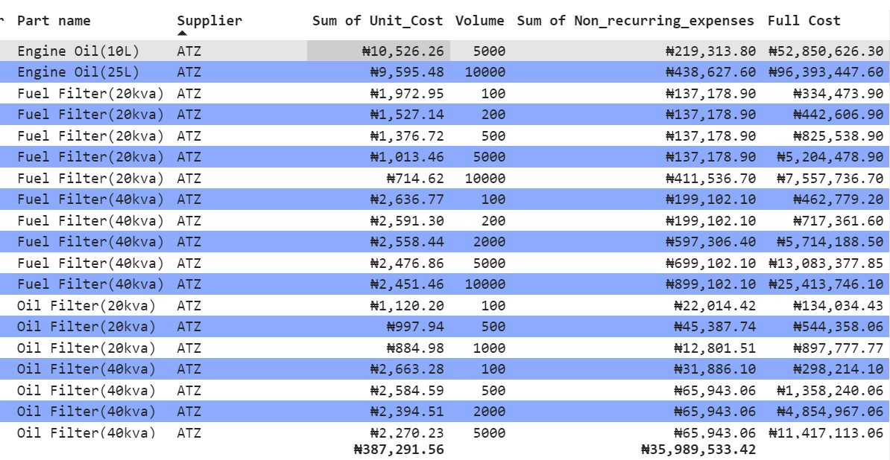
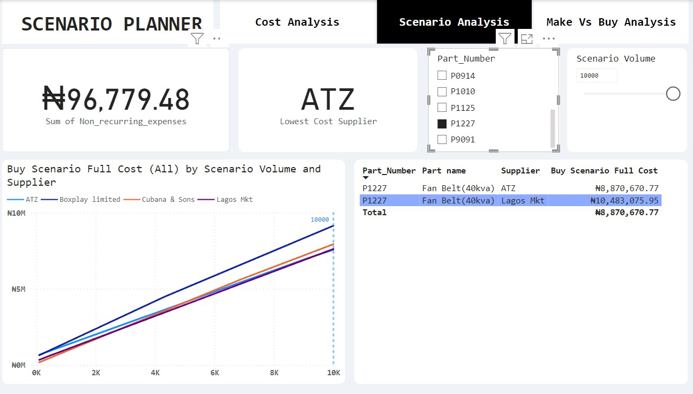

# SUPPLY CHAIN ANALYTICS

## Executive Summary
Supply chain analytics is a crucial component of modern businesses seeking to optimize their operations and enhance overall efficiency.

Supply chain analytics involves the use of data and advanced analytics tools to gain insights, make informed decisions, and improve the performance of a company's supply chain. It encompasses a wide range of activities, from demand forecasting to inventory management, transportation optimization, and supplier performance analysis.

## What is Make Vs Buy
“Make Vs Buy” is a strategic decision-making process that organizations go through when determining whether to produce (make) a product or component in-house or to purchase (buy) it from external suppliers. This decision has significant implications for cost, quality, time-to-market, and resource allocation.

## The Problem Statement

The company is into production and manufacturing of generators, spare parts and servicing.The organization is facing a Make Vs. Buy decision challenges for its products within its operations. The decision involves evaluating whether to produce internally or procure it from external vendors or suppliers.

## Key Challenges:

1. Cost Analysis: The company needs to conduct a comprehensive cost analysis that considers the expenses associated with in-house production (e.g., labor, machinery, facilities) versus external procurement (e.g., supplier contracts, transportation costs). The objective is to identify the most cost-effective option.

1. Quality and Control: The quality and control of the products are paramount. The organization must determine whether in-house production allows for better quality control and customization, or if external suppliers offer superior quality and expertise.

1. Resource Allocation: The decision involves allocating human, financial, and technological resources. The company must assess its capacity to handle the production of the generator parts internally and evaluate the opportunity cost of using these resources elsewhere.

1. Risk Management: There are risks associated with both options, such as production risks (e.g., operational disruptions) in-house and supplier risks (e.g., supply chain disruptions) when buying externally. Risk mitigation strategies must be considered.

1. Strategic Alignment: The choice between make and buy should align with the organization's strategic goals. The company needs to evaluate how the decision impacts its core competencies and strategic positioning.

## Objectives:

The primary objectives of this analysis are to:

1. Ensure the chosen option aligns with the organization's strategic goals and core competencies.
1. Determine the most cost-effective solution by (make or buy) for the manufacturing of the products or spare parts.
1. Manage potential risks and disruptions associated with the selected approach.
1. optimize resource allocation and improve operational efficiency.

## Scope:
This analysis will focus specifically on the make vs. buy decision for product/service/component. It will consider financial, operational, strategic, and compliance factors to reach an informed and well-supported decision.

## Deliverables:
The outcome of this analysis will be a clear recommendation for either making or buying product/service/component, along with a detailed rationale that considers cost-effectiveness, quality, resource allocation, and risk management. The recommendation will inform the organization's strategic decision-making process.

## Success Criteria:
The success of this project will be measured by the clear and well-supported recommendation provided, which aligns with the organization's strategic goals and optimizes the use of resources while mitigating risks.

## Dependencies:
This analysis may require collaboration with supply chain department, procurement department and internal and external stakeholders for data and information gathering. 

> [**RISKS**]
> **Potential risks include inaccurate cost analysis, insufficient data for decision-making, and unexpected disruptions in the supply chain.**

## Action Proposed for objectives

#### 1. Ensure the chosen option aligns with the organization's strategic goals.

From the image above we can see the numbers of tables we will be working with. The scenario volume, scenario volume(All), supplier yield, are not the raw data, those are table created using new measures and dax to support our analytics context. The data we have selected for the analysis aligns with the organizations strategic goals for the project.

#### 2. Determine the most cost-effective solution (make or buy) for the manufacturing of the products or spare parts.

  When determining whether to make or buy products or spare parts, i performed a cost-benefit analysis. This analysis considered various factors, including the volume of production, cost of manufacturing in-house, and the cost of purchasing from external suppliers.

The report includes a "Scenario Volume" slicer in the top right corner. It allows users to input a production volume, helping analyze the cost-effectiveness of making or buying products or spare parts for that specific volume. This feature facilitates scenario analysis and informed decision-making.

#### Recommendation

1. Optimize Production Volume: Utilize the "Scenario Volume" slicer to dynamically adjust the production volume based on market demand and cost considerations. This flexibility can help you optimize production levels in real-time.

2. Balance In-House and Outsourcing: Depending on the analysis,i will suggest an approach of stakeholders referring to this dashboard, to help them in choosen between make vs buy, because it helps in ensuring that you can efficiently meet demand while controlling costs.

3. Cost Transparency: We need to promote cost transparency across the supply chain, enabling stakeholders to understand how costs vary with changes in scenario volume.

#### 3. Manage potential risks and disruptions associated with the selected approach.

> # [ ONGOING PROJECT DOCUMENTATION]

Lets explore the quote data in detail.
Quotes :
I remember when i was still little, any time my mum sent me to the market, she always gave me a list of things to buy, with their prices, she will tell me the shops to go and the one not to go, so in essence she has done her own analysis. This was done to avoid stories that touches, though they will still be stories from me at the end of the day. So lets look at quotes as the list of things to buy.

Definition : Quotes refers to a formal document provided by a supplier to a potential customer or buyer. This document outlines the pricing, terms, and conditions for the products or services that the supplier is offering. Quotes are an essential part of the procurement or supply chain process, as they allow buyers to compare different suppliers and make informed decisions based on factors such as cost, quality, and delivery time.
They essentially say “ if you buy X volume of this part, you will need to pay Unit Cost per unit and a one-time cost equal to NON-reoccurring expenses.

Quotes are specific to the product, volume and supplier. So in that case for supply chain decisions, it does not make sense to aggregate these fields. So I will set the volume columns in Power Bi, which has summarization set to default to Don’t summarize.

Lets create a visualization displaying all of the fields in the quote table, with a column chart that shows the number of unit price quotes provided for each part number.

The image above showcases my supplier selection visualizations dashboard, The sole purpose of this dashboard is to help you determine the best option in the case of suppliers that you can choose to supply the products you need for your services. There are about 7 visualization in the supplier selection dashboard, which will be broken down for further explanations.

They are :

Cost breakdown
Sum of unit cost by volume and supplier.
Sum of non reoccurring expenses by volume and supplier.
A card visual that shows the lowest cost supplier
A volume and a part number slicer
and a table visual, that consist of part number, part name, sum of unit cost etc.
let me try to break down some of the terms that i will use that are related to supply chain:

Unit cost: This is the cost associated with producing or procuring a single unit of a product.

Extended cost: The cost paid for the products only (does not include onetime expenses)

Extended Cost = (Unit Cost) * (Quantity of Units Purchased)

Non-recurring expenses: One-time costs required to enable production. Non-recurring expenses are generally not part of the regular ongoing operational costs of an entity. Instead, they arise from special circumstances or events.

Common examples of non-recurring expenses

• Legal fees
• Engineering expenses for production set-up
• Minimum charge to occupy manufacturing equipment.
• Currency exchange losses or Gains
• Environmental Cleanup cost

Full Cost
The total amount a company must pay to buy a certain quantity of products
Full Cost = Extended Cost + non-recurring expenses
Or
Full Cost = (10000 per gallon * 10gallons) + 65000 set-up fee = 165000

Visualizing lowest cost supplier
Scenario

My line manager has asked for a report page that shows :

The suppliers name with the lowest full cost for a part number and quote volume combination.
The full cost breakdown by extended cost and full cost.
Visibility to all of the other supplier quotes and full cost for the part number.
To use a card visualization that shows lowest full cost supplier for the part number & volume combination
All of these instructions and recommendation has been done on fig 3. but lets try to solve a problem.

Management are asking for something specific, like; what is the lowest full cost for a part number of P1010 on a volume of 2000.

To answer the question above:

The lowest cost supplier for part number P1010 on a volume 2000 is ATZ , we can also see it has the lowest non reoccurring expenses on the 2000 volume mark. In my opinion and based on this analysis we will all go for ATZ.

You can view the dashboard & interact with it here :https://app.powerbi.com/reportEmbed?reportId=0e909fee-aed2-490b-8f5e-36b6eed57236&autoAuth=true&ctid=e1e4f47f-4370-4de4-8a71-48984d434887

Creating a volume parameter and scenario analysis
We will explore building a scenario analysis tool to examine how our cost calculations change as volumes change.

Note:
In reality its highly unlikely to order the amount of product that was quoted.
Projects start with assumptions, so analysis tools should adjust to this uncertainty

Scenario & volume changes
What if our production estimate does not match the quoted volume. To be honest, things are not that straight forward as I made it seem earlier. Because it is highly unlikely to order the exact numbers that were quoted. That is where the scenario analysis comes in.

All projects starts with uncertainty, sources of uncertainty are :
• Demand
• Product market fit
• External economic conditions
• Price

In fig 4 we created a scenario volume parameter. This will make the report dynamic. Parameters adds a user-controlled slicer to the report. you can find it on the top right corner.

This will help to identify how the cost calculations changes and in the dashboard it shows how the full cost changes across different potential production volumes.

