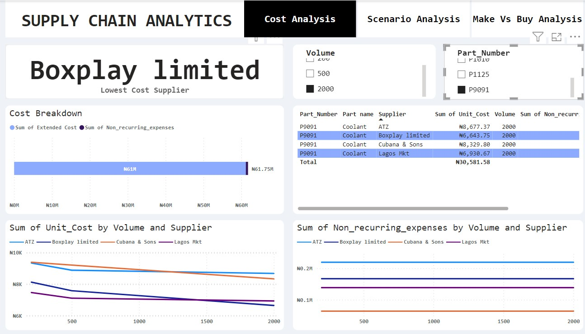

# SUPPLY CHAIN ANALYTICS

## Executive Summary
Supply chain analytics is a crucial component of modern businesses seeking to optimize their operations and enhance overall efficiency.

Supply chain analytics involves the use of data and advanced analytics tools to gain insights, make informed decisions, and improve the performance of a company's supply chain. It encompasses a wide range of activities, from demand forecasting to inventory management, transportation optimization, and supplier performance analysis.

## What is Make Vs Buy
“Make Vs Buy” is a strategic decision-making process that organizations go through when determining whether to produce (make) a product or component in-house or to purchase (buy) it from external suppliers. This decision has significant implications for cost, quality, time-to-market, and resource allocation.

## The Problem Statement

The company is into production and manufacturing of generators, spare parts and servicing.The organization is facing a Make Vs. Buy decision challenges for its products within its operations and also a problem of choosing the best possible supplier. The decision involves evaluating whether to produce internally or procure it from external vendors or suppliers.

## Key Challenges:

1. Cost Analysis: The company needs to conduct a comprehensive cost analysis that considers the expenses associated with in-house production (e.g., labor, machinery, facilities) versus external procurement (e.g., supplier contracts, transportation costs). The objective is to identify the most cost-effective option.

1. Scenario Analysis: The organization want to be able to handle uncertainties in different scenarios, which they cant at the moment.

1. Make or buy decision: The decision involves allocating human, financial, and technological resources. The company must assess its capacity to handle the production of the generator parts internally and evaluate the opportunity cost of using these resources elsewhere.

1. Access Control

## Objectives:

The primary objectives of this analysis are to:

1. Ensure the chosen option aligns with the organization's strategic goals and core competencies.
1. Determine the most cost-effective solution by (make or buy) for the manufacturing of the products or spare parts.
1. Manage potential risks and disruptions associated with the selected approach.
1. optimize resource allocation and improve operational efficiency.

## Scope:
This analysis will focus specifically on the make vs. buy decision for product/service/component. It will consider financial, operational, strategic, and compliance factors to reach an informed and well-supported decision.

## Deliverables:
The outcome of this analysis will be a clear recommendation for either making or buying product/service/component, along with a detailed rationale that considers cost-effectiveness and resource allocation. The recommendation will inform the organization's strategic decision-making process.

## Success Criteria:
The success of this project will be measured by the clear and well-supported recommendation provided, which aligns with the organization's strategic goals and optimizes the use of resources while mitigating risks.

## Dependencies:
This analysis may require collaboration with supply chain department, procurement department and internal and external stakeholders for data and information gathering. 

> [**RISKS**]
> **Potential risks include inaccurate cost analysis, insufficient data for decision-making, and unexpected disruptions in the supply chain.**

## Action proposed for problems

### 1 Cost analysis for supplier selection:
The company aims to conduct a comprehensive cost analysis that takes into account the expense variations associated with products sourced from different suppliers. This analysis will encompass sum of extended cost, sum of non reoccuring_expenses, sum of unit cost by volume & supplier, and sum of non reoccuring expenses by volume and supplier. The primary objective is to identify the most cost-effective option in terms of the supplier quote. 

### Problem Explained :
If the stake holders want a volume of 2000 for Part number P9091, the supplier will be BoxPlay limited, The supplier here is the lowest cost supplier for that intended volume.

### 2. Scenario Analysis :
lets explore building a scenario analysis tool to examine how the cost calculations change as volumes change with the aid of Dax. i will create visualizations of how the full cost changes across the different potential production volumes and how this will help organization handle different scenarios.

### Problem Explained  :
There is a need for a higher volume of product, which is outside the quoted amount that the organization have, the volume is 10000 for part number P1227. Even though we did not have the quoted figures for this, because what was shared by the suppliers had a maximum 2000 quoted volume, how ever there is a demand for 10000 volumes. Scenario analysis helps in doing this. As we can see from the image below ATZ company meets the requirement.

### 3. Determine the most cost-effective solution (make or buy) for the manufacturing of the products or spare parts.

 The company aims to choose between to either make a product or buy one, i performed a cost-benefit analysis. This analysis considered various factors, including the volume of production, cost of manufacturing in-house, and the cost of purchasing from external suppliers. This analysis will encompass ; scenario volume slicer, a buy scenario full cost by supplier and part number , table that consist of calculated and non calculated columns : (Part_number, Part_name, Make vs buy , cost avoidance) , also another table that consist of calculated and non calculated columns : (Part_name, Part_number, Machine_model, existing_capacity, unit_capacity, additional_unit_capacity_required, Make_scenario_full_cost). The primary objective is to choose between make vs buy.
 

 ### Problem Explained  : 
 For a scenario volume of 7500 , the stake holders want to know which is beneficial in the long run, should they do the product in house or should they buy it. and this should come with a reason.

For the part_number P1010, its advisable to buy, because you will be avoiding a cost of 222k, if check the buy scenario full cost by supplier and part number table , you can also see that its also telling you the name of the supplier that will give you this.

### Access Control

We can handle access control of the data that is available to different team by managing roles on Power Bi.

### Data Model

### APPRECIATION

Thank you for going through my write up, up till this point, you can click on the link below to interact with the dashboard, to get a full picture of my explanation and scenarios. If you experience any issue with the link, kindly check the supply chain pbix file. Thank you, lets call it a day!..

[Supply Chain Dashboard](https://app.powerbi.com/reportEmbed?reportId=0e909fee-aed2-490b-8f5e-36b6eed57236&autoAuth=true&ctid=e1e4f47f-4370-4de4-8a71-48984d434887)

